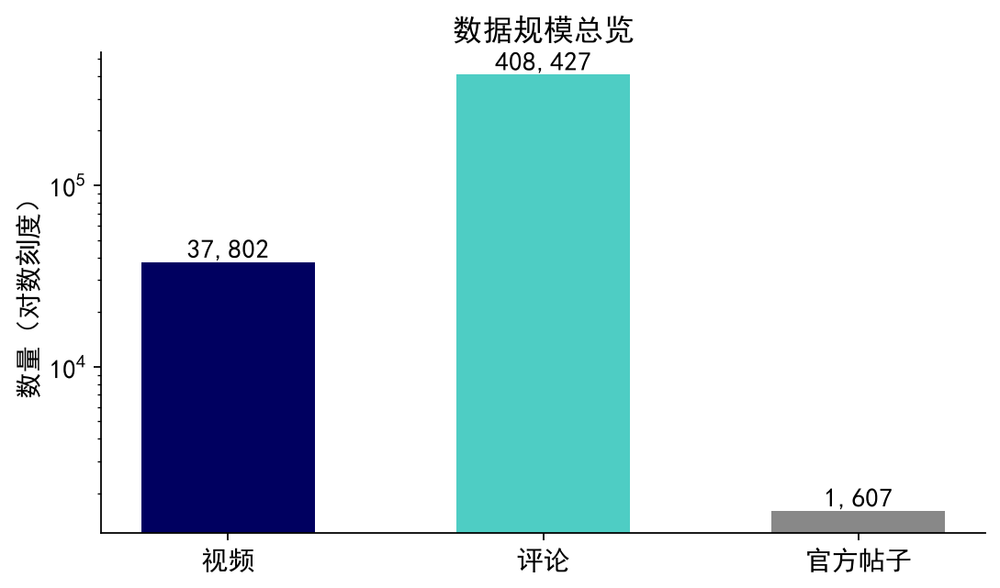
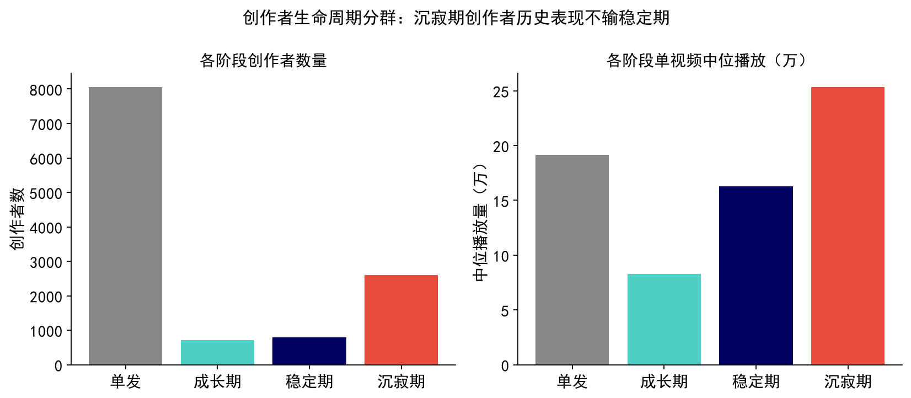
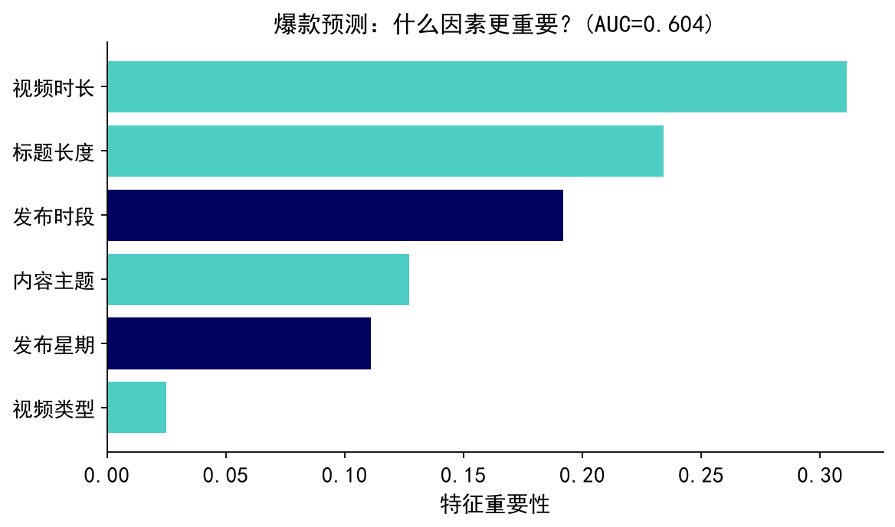
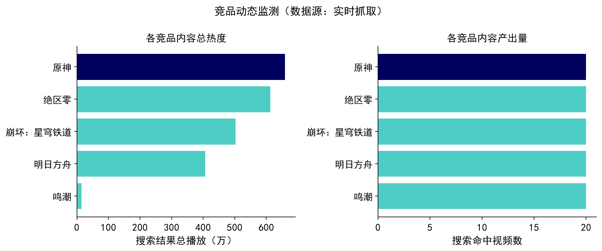
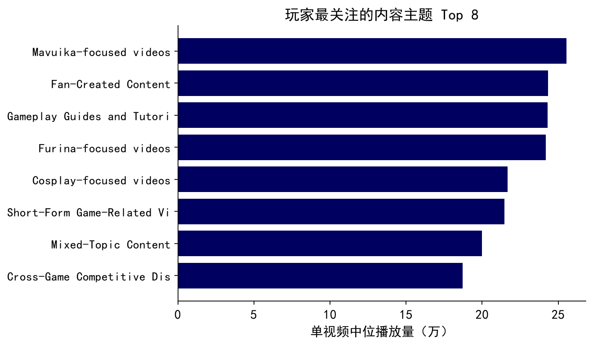
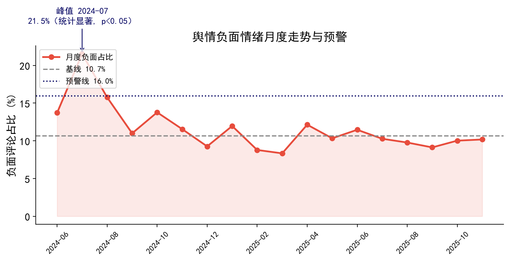
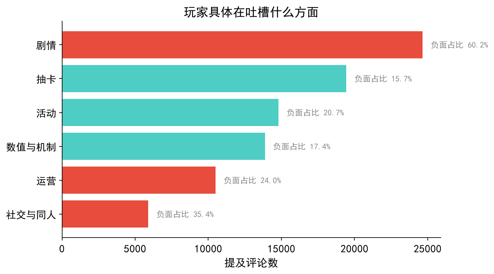
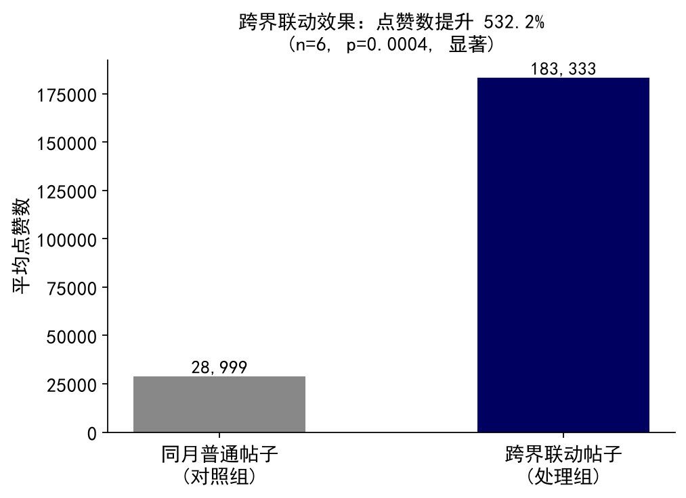
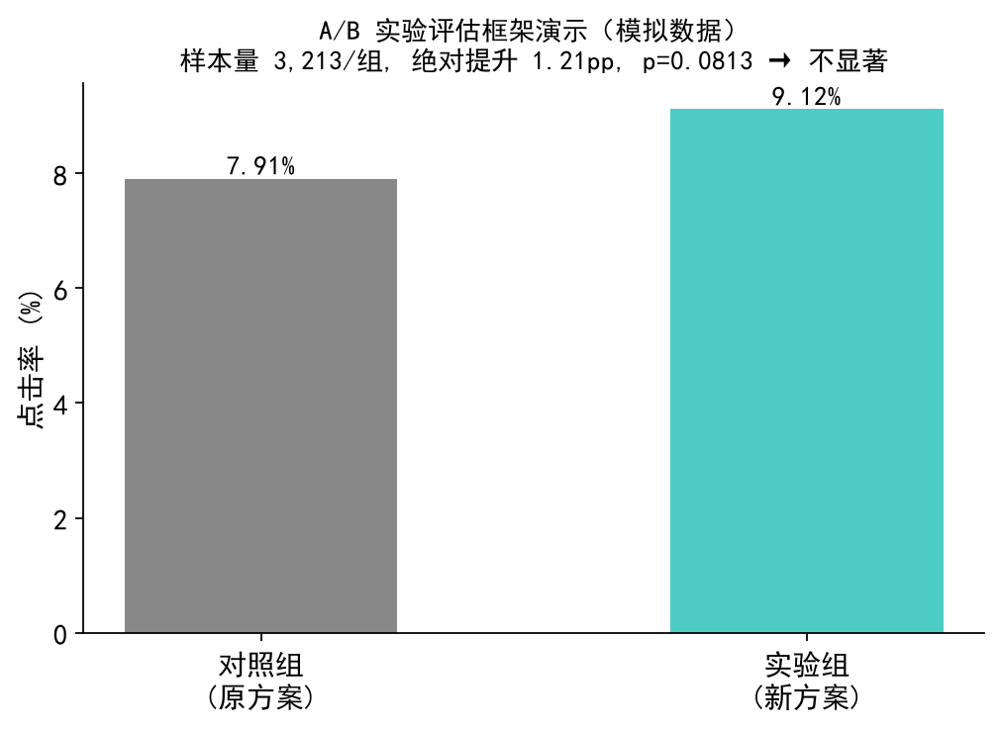

# 原神 B 站玩家生态与舆情分析 · 项目书

> 一个面向「内容生态创作者管理 / 作品分析 / 舆情与竞品监测」的端到端「数据 + AI」工具项目。
> 从游戏外部社区（B 站）的公开数据出发，经结构化分析，最终沉淀为业务可直接上手的内部工具看板，为内容经营与业务决策提供数据参考。

---

## 一、项目概述

| 项 | 说明 |
| --- | --- |
| 目标 | 分散的社区数据 → 结构化分析 → 可交互的内部工具，覆盖「内容经营」与「舆情 / 竞品监测」两条业务线 |
| 数据 | Kaggle 公开数据集（视频 3.8 万 / 评论 40.8 万 / 官方帖子 1607）+ B 站实时抓取（排行榜 / 搜索） |
| 能力 | 数据分析 · 调用主流 AI 模型 API（DeepSeek）· 内部工具看板（Streamlit）· 竞品 / 榜单监控爬虫 |
| 工程 | 70+ 单元测试，ruff + mypy + GitHub Actions CI 全接入；合成数据 / 假客户端保证 CI 不依赖真实数据或网络 |

本项目对应实习四条职责的逐条落地：

| 实习职责 | 本项目对应模块 |
| --- | --- |
| ① 内容生态创作者管理及作品分析工具 + 内部看板 | 作品打标 / 作者分类与增长 / 爆点预测与总结（看板 3 个工具页） |
| ② 自动化舆情、社媒热点监测脚本 / AI 小工具 + 界面 | 竞品动态监测 / 榜单数据监控 / 舆情词云 AI 总结（看板 + CLI 脚本） |
| ③ 调用主流 AI 模型 API 做清洗 / 归类 / 分析 | `text_pipeline`：清洗 → AI 归类 → AI 总结 工作流（DeepSeek） |
| ④ 关注 AI 前沿、探索创新应用 | 以「关键词覆盖率 18%」量化驱动 LLM 选型；知识蒸馏、爆款语义总结、舆情语义总结 |

---

## 二、数据规模



| 数据 | 规模 | 时间跨度 |
| --- | --- | --- |
| 视频 | 37,802 条 | 2024-07 ~ 2025-11 |
| 评论 | 40.8 万条（已聚类） | — |
| 官方帖子 | 1,607 条 | — |

数据质量审查发现约 **35% 的主题噪声**（混入的泛娱乐视频），用主题聚类把核心内容分离出来；加载阶段做「列存在性 / 空值率 / 日期解析率」三类契约校验，避免脏数据静默流入下游。

---

## 三、特色功能

### 职责①　内容生态创作者管理 & 作品分析工具

落地为内部看板的 3 个工具页（`dashboard.py`）。

#### 1. 作品打标（关键词基线 + AI 语义打标）

- 粘贴文本或上传 CSV，对评论 / 标题打「情感极性 + 内容方面（剧情 / 抽卡 / 活动 / 数值机制 / 运营 / 社交）」标签。
- **关键发现驱动技术选型**：关键词规则在 40.8 万条真实评论上覆盖率仅 **18.2%**，漏标的 81.8% 多为口语化、反讽、表情符号——这量化证明了必须引入 AI 语义打标。

> 📷 **[请插入看板截图：作品打标页]**　展示「AI 语义打标」结果表（情感 + 方面 + 依据）与情感分布图。

#### 2. 作者分类与增长分析



- 按发布频次与活跃时长，把 UP 主分为 **单发 / 成长期 / 稳定期 / 沉寂期** 四类。
- **业务洞察**：「沉寂期」创作者的历史中位播放反而不输「稳定期」——他们是潜在的**唤回 / 再合作高价值目标**，而非把资源都押在当前活跃者身上。看板专门列出这批唤回目标。
- 同时按月度产出增长率给内容主题打「增长 / 平稳 / 衰退」标签，指导资源倾斜方向。

> 📷 **[请插入看板截图：作者分类与增长页]**　展示各阶段柱状图 + 潜在唤回目标表 + 主题增长率。

#### 3. 内容爆点：预测 + 总结



- **预测**：随机森林预测视频是否成为爆款（AUC ≈ 0.60）。特征重要性显示内容相关特征（标题长度、时长）高于纯发布技巧（时段、星期）→ **爆款由内容质量主导**。
- **交互打分器**：在看板输入计划发布的视频参数（主题 / 类型 / 时长 / 时段 / 标题字数），实时算出爆款概率。
- **AI 爆点总结**：抽取真实爆款标题 → DeepSeek 归纳可复制的选题套路与建议（预测回答「会不会爆」，总结回答「为什么爆、怎么复制」）。

> 📷 **[请插入看板截图：内容爆点页]**　展示 AUC + 特征重要性图 + 单视频概率打分器 + AI 选题总结。

---

### 职责②　自动化舆情、社媒热点监测

#### 4. 竞品动态监测（B 站抓取）



- 对一组对标二游（原神、星穹铁道、绝区零、鸣潮、明日方舟）在 B 站搜索，聚合各自的内容产出量、总播放、Top 作品。
- 抓取层复刻了 B 站公开接口的 **WBI 签名算法**，只取公开非个人数据，自带请求限速 + 磁盘缓存 + 风控降级。

> 📷 **[请插入看板截图：竞品动态监测页]**　展示各竞品总播放 / 产出量对比柱状图。

#### 5. 榜单数据监控

- 抓取 B 站全站排行榜 → 落地带时间戳快照 → 与上次对比，自动标出**新上榜 / 跌出 / 排名变化**。
- 可用 `scripts/monitor_run.py` 定时跑，积累时序快照。

> 📷 **[请插入看板截图：榜单数据监控页]**　展示榜单表 + 「较上次排名变化 Top5」。

#### 6. 舆情词云 AI 总结

**AI 打标词云（按 LLM 情感分组 + AI 语义关键词加权）**


相对「纯词频词云」基线（`--source keyword`，按数据集自带聚类分组）的两点升级：① 分组依据从「数据集粗粒度聚类」换成 **LLM 逐条打出的情感标签**；② 用 `summarize_opinions` 提炼的 **AI 语义关键词加权放大**，让词云突出「加强 / 剧情 / 兑换码 / 复刻 / 新地图」等议题词，而非「哈基米 / 居然」这类高频口水词。

- 由 `scripts/make_wordcloud.py --source ai --sample N` 生成（`--sample` 控成本，与 `ai_analyze.py` 一致）；`--source keyword` 可另出纯词频图作离线对照。
- **AI 总结**进一步合并同义表达、过滤噪声，直接产出业务可读结论：核心议题 + 占比 + 代表性原声 + 词云关键词 + 可执行运营建议。

实际跑出的一份 AI 舆情总结（节选自 `outputs/ai_analysis.summary.json`）：

> **总体判断**：玩家对前瞻内容中特定角色获得过多资源表示强烈不满，并质疑直播画面技术问题，负面情绪集中。
>
> **核心议题**：角色与剧情内容争议（约 50%）/ 前瞻画面异常（约 30%）/ 玩家情绪表达（约 20%）
>
> **运营建议**：① 排查前瞻直播画面异常并发说明；② 平衡后续版本角色资源分配；③ 社区长文解释设计思路；④ 收集诉求考虑补偿。

> 📷 **[请插入看板截图：舆情词云 AI 总结页]**　展示关键词云 + 议题 / 原声 / 建议。

---

### 职责③　调用主流 AI 模型 API：清洗 → 归类 → 分析

`src/text_pipeline.py` 三段式工作流（接入 DeepSeek，OpenAI 兼容协议，可一键切换任意兼容服务）：

1. **清洗**：规则层去链接 / @ / 回复前缀，压缩重复字符并去重——零成本、可离线。
2. **归类**：批量调 API，每条输出情感极性 + 多方面标签 + 依据；强制 JSON、自动重试、非法标签兜底、单批失败不拖垮整体。
3. **分析**：对负面评论做语义级舆情总结、对爆款标题做选题总结。

**关键词 vs AI 对照实测**（`scripts/keyword_vs_ai.py`，取 30 条关键词漏标的评论）：AI 把其中 **50%** 标出有效方面（含 9 条负面），且对纯闲聊 / 表情正确判为「其他」——既补覆盖率，又自带噪声过滤。

---

### 职责②③加分　舆情打标训练（知识蒸馏）

直接用 LLM 给全量 40.8 万条评论打标，成本与耗时都不可接受。这里用**知识蒸馏**把 AI 能力固化成一个低成本本地模型（`src/sentiment_train.py`、`scripts/train_sentiment.py`）：

1. **教师**：用 DeepSeek 给小样本（数百条）打高质量情感标签；
2. **学生**：在「文本 → LLM 标签」上训练字符级 TF-IDF + 逻辑回归分类器（中文无需分词、仅用项目已有的 sklearn）；
3. **收益**：学生模型离线、免 API、毫秒级，可低成本推理全量评论；用留出集的准确率 / 宏 F1 / **与教师标签一致率**评估蒸馏质量。

看板「作品打标」页因此提供五档：关键词基线（秒出）/ AI 语义打标（最准）/ **本地模型（蒸馏 · 免费秒级，适合全量）** / **本地微调大模型（LoRA · Qwen2.5-7B）** / **🧭 智能路由（Router Agent · 按难度自动分配 + 校验升档）**。

> 📷 **[请插入截图：训练输出的留出集指标 / 看板「本地模型」打标结果]**

---

### 职责③加分　下一代 AI 管线：RAG 反幻觉 + 本地 LoRA 微调

在既有链路之上新增两条**互不破坏现有环境**的进阶轨道（`uv` 可选 extra，CI 无 GPU 也能跑通）：

**① RAG 检索增强（`src/rag/`，对抗黑话误判）**　玩家评论充斥社区黑话（「歪了」「保底」「深渊螺旋」「圣遗物词条」），通用 LLM 易按字面误判情感/方面。方案：用数据集（评论聚类关键词 + 官方动态 + 高赞 UGC）异步构建本地「梗 & 设定词典」向量库（`ingestion.py`），调用 DeepSeek 前先由**混合检索器**（稠密哈希/语义嵌入 + 稀疏 BM25 加权融合，`retriever.py`）拦截评论中的黑话、检索释义并注入系统提示。向量库默认走纯 numpy 内存档（零外部基建），需持久化时再切 ChromaDB 本地模式（`vector_store.py`）。

**② 本地 LoRA 微调（`src/finetune/`）**　把 LLM 标注的高置信数据格式化为 LLaMA-Factory 所需 JSONL（`dataset_formatter.py`，并由 `scripts/build_finetune_dataset.py` 做分层抽样标注 + 留出集切分），用 QLoRA 在消费级 GPU（如 RTX 4090, 24GB）上微调 Qwen2.5-7B（`train_lora.sh`：4-bit 量化 + FlashAttention-2 + 梯度累积）。微调后用 `scripts/eval_lora.py` 在留出集上评估并做反讽错例分析，驱动增量迭代；产物经 `LocalLLMClassifier` 加载推理，得到比 TF-IDF 更懂语义/黑话、仍离线免 API 的本地分类器。

**③ 智能路由编排 Agent（`src/agents/`，按难度分配算力）**　多条打标轨道（关键词 / 蒸馏 / 本地或云端 LoRA / RAG-DeepSeek）各有成本与精度的权衡，由 `RouterAgent` 统一调度：先用零成本的离线难度画像（黑话 / 反讽 / 长度）判断该投多少算力——容易的评论走便宜轨道，难句直接起步于语义轨道，并经「**检索 → 推理 → 校验**」三角复核（critic 默认零成本规则校验、可选 LLM 评审员）；校验不过则沿成本阶梯自动升档重判，把贵算力只花在值得的样本上。不可用轨道（无 API / 无 GPU / 无模型）自动跳过，环境自适应、离线优雅退化。看板「作品打标」页新增第五档「🧭 智能路由（Router Agent）」，逐条展示命中轨道、置信、校验状态与升档次数。

**云端算力分流（场景 B）**　针对笔记本无 GPU 的硬约束，提供「本地调用、云端算力」链路：在 AutoDL / RunPod 等平台微调后，用 vLLM 把 Qwen 起成 OpenAI 兼容端点（`scripts/serve_lora.sh`），本地只需在 `.env` 填入云端地址，路由便自动接入一条 `lora_server` 轨道、难句优先走自训模型而不烧 DeepSeek 额度。本地零改动，靠 `ServedLLMClient` 复用既有 OpenAI 协议实现，完整部署流程见 `docs/CLOUD_LORA.md`。

> 📷 **[请插入截图：RAG 注入黑话释义前后的打标对比 / LoRA 训练 loss 曲线 / 看板「智能路由」逐条命中轨道与校验状态 / 各轨道处理量分布]**

---

## 四、分析结果汇总（Python 产出图表）

### 玩家生态：玩家最关注什么



角色专题与二创在中位播放、点赞上显著领先，是社区内容生态的核心。（用中位数而非均值，避免长尾爆款拉偏。）

### 舆情监控：负面情绪月度走势与预警



负面舆情存在与版本节奏相关的月度峰值（峰值 **21.5%** vs 基线 **~10.7%**）。预警提供两套互相印证的口径：
- **双比例 z 检验**：确认峰值相对基线**统计显著**（p < 0.05），而非样本噪声；
- **滚动窗口 z-score**：替代固定倍数阈值，能适应基线随版本的缓慢漂移。

### 方面级情感：玩家具体在吐槽什么



「数值与机制」「运营」两方面的负面占比明显高于「剧情」「社交」——说明负面更多指向**可运营调整**的范畴（数值平衡、客服响应），而非内容本身不被接受。

### 跨界联动效果的因果推断



用同月匹配 + 置换检验（而非简单看绝对数字）评估跨界联动公告相对同期普通公告的点赞增量，控制版本节奏等随时间变化的混杂因素；处理组样本极小（n=6）时诚实报告不确定性。

### A/B 实验评估框架



实现样本量 / 功效计算 + 双样本显著性检验，用模拟数据验证方法正确性。数据集是观察性数据，此模块刻意做成通用框架，接入真实埋点转化数据即可直接复用。

### 技术读者用六联图面板


`uv run genshin-analyze` 一键产出的六联图，面向技术读者整合上述核心分析。

---

## 五、内部工具看板总览

一个 Streamlit 看板（`dashboard.py`）整合全部 6 个工具页；无真实数据或抓取被风控时自动降级到演示数据，开箱即跑。

```bash
uv sync --extra dashboard --extra llm --extra scrape
uv run streamlit run dashboard.py
```

> 📷 **[请插入看板截图：首页 / 侧边栏 + 6 个 tab 标签栏]**　展示整体界面与数据源 / AI 能力状态。

（下图为既有示例看板效果，最终以实际运行截图为准）


---

## 六、技术栈与工程规范

- **数据 / 建模**：pandas · numpy · scikit-learn · scipy · matplotlib
- **AI**：openai SDK（DeepSeek / OpenAI 兼容）
- **工具界面**：streamlit · altair
- **抓取**：requests（复刻 WBI 签名）
- **工程**：pytest（70+ 用例）· ruff · mypy · GitHub Actions CI · uv 依赖管理

工程亮点：单元测试用合成 fixture + fake LLM / HTTP client，**不依赖真实数据或网络**即可在 CI 全部跑通；密钥从 `.env` 读取、绝不入库；抓取严格限速并尊重风控（命中即降级，不暴力重试）。

---

## 七、AI / LLM 应用工程技术

项目中**实际落地**的 AI 工程技术（非多智能体系统，如实归类为 LLM 应用 / Agent 工程；完整版含代码位置见 [`docs/AI_ENGINEERING.md`](../docs/AI_ENGINEERING.md)）：

| # | 技术 | 用在哪 |
| --- | --- | --- |
| 1 | **OpenAI 兼容接入**（换 base_url 即切换服务）+ 密钥环境变量化 | `llm_client` / `config` |
| 2 | **结构化输出（JSON Mode）** + schema 形状化 Prompt | `text_pipeline` |
| 3 | **Prompt 工程**：system / user 分离、受限标签空间、编号批处理 | 分类 / 总结 prompts |
| 4 | **输出校验与对齐**：定长对齐、非法标签兜底 | `_normalize_result` |
| 5 | **鲁棒性**：指数退避重试、单批失败隔离、优雅降级 | `chat_json` / `classify_with_llm` |
| 6 | **成本控制**：规则清洗 + LLM 两段分层、批处理、抽样 | `clean_text` → `analyze_comments` |
| 7 | **数据驱动选型**：用 18% 覆盖率量化驱动 LLM 决策 | `keyword_vs_ai.py` |
| 8 | **知识蒸馏**：LLM 当标注教师 → 轻量学生模型全量推理 | `sentiment_train` |
| 9 | **LLM 作为分析者**：Map→Reduce 语义聚合（舆情 / 爆点总结）+ 关键词加权词云 | `summarize_*` / `wordcloud_gen` |
| 10 | **可复用 + 可验证**：能力封装成模块，测试用 fake client 不触网 | 全 `src/` + `tests/` |

---

## 八、合规说明

竞品 / 榜单抓取仅获取 B 站**公开、非个人数据**（排行榜、搜索结果、公开视频统计），用于市场 / 竞品分析。所谓「逆向」仅指复刻公开前端接口的 WBI 签名算法，不绕过登录、不抓取私密数据；内置请求限速与缓存以控制频率。使用时请遵守 B 站 robots 协议与服务条款。

---

## 九、局限与后续方向

- **时间锚点近似**：评论无可靠时间戳，用所属帖子发布时间近似，存在滞后误差。
- **爆款预测特征有限**：仅用元数据，未引入标题 / 封面语义特征，AUC 上限被结构性限制。
- **因果效应样本小**：跨界联动 n=6，方向可信但置信区间宽。
- **后续**：① 自动化调度（定时跑监控 + 舆情超阈值推送）；② 事件驱动的周 / 日级细粒度舆情监控；③ 用更大样本与更强学生模型提升蒸馏分类器精度。

---

> 📌 **截图清单**（运行 `uv run streamlit run dashboard.py` 后逐页截图，替换上方占位）：
> 1. 看板首页 + 侧边栏　2. 作品打标页　3. 作者分类与增长页　4. 内容爆点页
> 5. 竞品动态监测页　6. 榜单数据监控页　7. 舆情词云 AI 总结页
